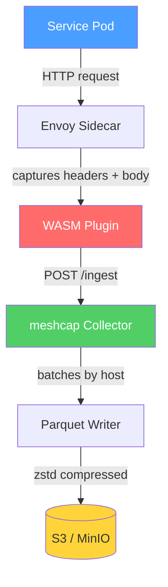

# meshcap

**Kubernetes-native HTTP traffic capture for service meshes**

[](https://go.dev)
[](LICENSE)
[](https://github.com/jycamier/meshcap/releases)
[](https://goreportcard.com/report/github.com/jycamier/meshcap)

---

meshcap captures HTTP traffic flowing through your Istio service mesh and persists it to cloud storage. It runs transparently alongside your services using an Envoy WASM plugin — no application changes required. Supports pluggable output formats ([Parquet](https://parquet.apache.org/), HAR) and storage backends (AWS S3, Azure Blob Storage).

## How It Works



## Features

- **Transparent capture** — Envoy WASM plugin intercepts HTTP traffic without code changes
- **Pluggable formats** — Parquet (zstd compressed) or HAR (HTTP Archive 1.2)
- **Multi-cloud storage** — AWS S3, MinIO, or Azure Blob Storage
- **Hive partitioning** — Files organized by `host/year/month/day/hour` for query efficiency
- **Prometheus metrics** — Built-in observability with counters, gauges, and histograms
- **Helm chart** — Production-ready Kubernetes deployment with HPA and KEDA support
- **Graceful shutdown** — Flushes all buffered records before stopping

## Quick Start

Get a local environment running in seconds with Docker Compose:

```bash
git clone https://github.com/jycamier/meshcap.git
cd meshcap
docker compose up
```

This starts the collector and a MinIO instance. Send a test request:

```bash
curl -X POST http://localhost:8080/ingest \
  -H "Content-Type: application/json" \
  -d '{"request_id":"test-1","req_method":"GET","req_path":"/api/users","req_host":"myapp.example.com","captured_at":"2025-01-01T00:00:00Z","timestamp_ns":1735689600000000000}'
```

Parquet files will appear in the MinIO `capture` bucket (console at [localhost:9001](http://localhost:9001), credentials: `minioadmin`/`minioadmin`).

## Documentation

| Document | Description |
|----------|-------------|
| [Architecture](doc/architecture.md) | System design, data flow, component internals, and S3 partitioning strategy |
| [Getting Started](doc/getting-started.md) | Local development with Docker Compose and Kubernetes deployment with Helm |
| [Configuration](doc/configuration.md) | Complete reference for CLI flags, environment variables, and Helm values |
| [WASM Plugin](doc/wasm-plugin.md) | Building, deploying, and configuring the Envoy/Istio traffic capture plugin |

## Contributing

Contributions are welcome! Please open an issue or submit a pull request.

```bash
make build      # Build the collector binary
make test       # Run tests with race detection
make lint       # Run linter
```

## License

This project is licensed under the Apache License 2.0 — see the [LICENSE](LICENSE) file for details.
