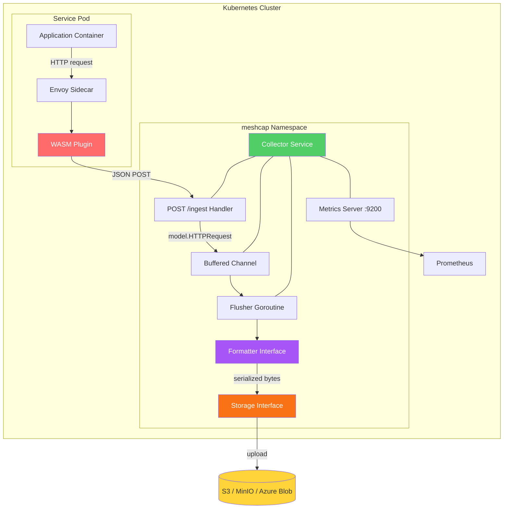
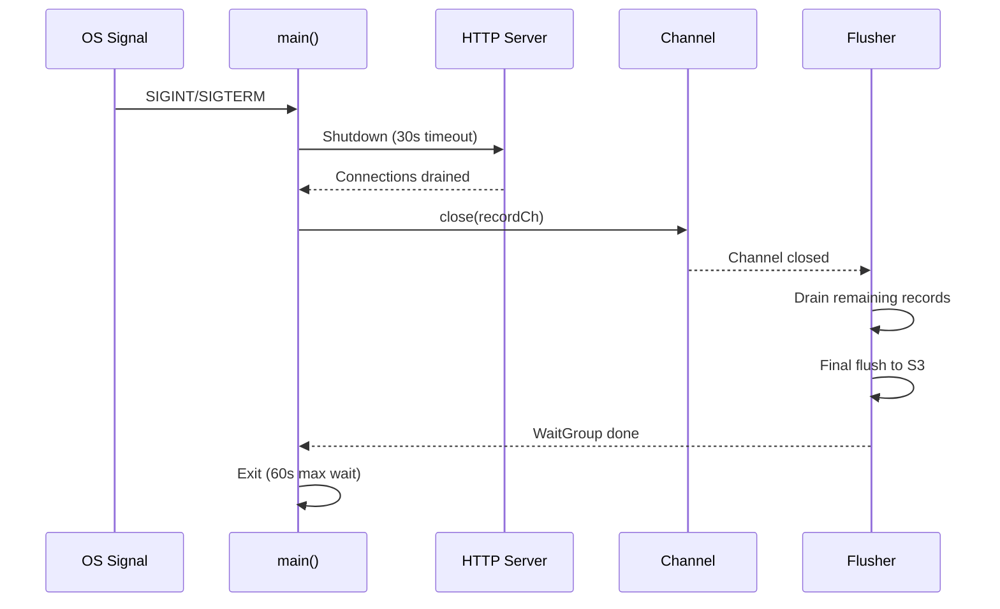

# Architecture

## Overview

meshcap follows a pipeline architecture: an Envoy WASM plugin captures HTTP traffic in the data plane and forwards it to a central collector, which buffers, serializes, and uploads records to cloud storage. The collector uses pluggable **Formatter** and **Storage** interfaces, enabling any combination of output format (Parquet, HAR) and storage backend (S3, Azure Blob).

## System Architecture



## Components

### WASM Plugin (`wasm/`)

An Envoy L7 HTTP filter built with the [proxy-wasm-go-sdk](https://github.com/proxy-wasm/proxy-wasm-go-sdk). It operates as a separate Go module under `wasm/`.

**Lifecycle:**

1. `OnPluginStart` — Reads config from the Istio `WasmPlugin` CRD (collector cluster address, max body size)
2. `OnHttpRequestHeaders` — Captures `:method`, `:path`, `:authority`, `x-forwarded-for`, `x-request-id`, and source pod metadata from Envoy node properties
3. `OnHttpRequestBody` — Reads the request body (up to `maxBodySize`)
4. `dispatchToCollector` — Serializes the captured data as JSON and sends an async HTTP call to the collector via `DispatchHttpCall`

The plugin is non-blocking: it uses Envoy's async dispatch mechanism, so it does not add latency to the proxied request.

### Ingest Handler (`internal/collector/`)

A standard `net/http` handler on `POST /ingest` that:

1. Validates the HTTP method (POST only) and payload size
2. Deserializes JSON into `model.HTTPRequest`
3. Sends the record to a buffered Go channel (non-blocking `select`)
4. Returns `202 Accepted` on success, `503 Service Unavailable` if the buffer is full

### Flusher (`internal/writer/flusher.go`)

A long-running goroutine that reads from the buffered channel and periodically flushes records to storage:

1. Accumulates records in memory
2. On timer tick (configurable via `FlushInterval`) or channel close, groups records by `req_host`
3. Serializes each group via the `Formatter` interface
4. Builds a Hive-partitioned key via `storage.BuildKey()`
5. Uploads via the `Storage` interface with retry logic (exponential backoff: 1s, 2s, 4s)

On shutdown, the flusher drains all remaining records from the channel before performing a final flush.

### Formatter Interface (`internal/format/`)

Decouples serialization from the flush pipeline:

```go
type Formatter interface {
    Format(records []model.HTTPRequest) ([]byte, error)
    Extension() string // ".parquet", ".har"
}
```

**Implementations:**

- **ParquetFormatter** — Serializes records into Apache Parquet format using [parquet-go](https://github.com/parquet-go/parquet-go) with zstd compression. Schema columns: `request_id`, `captured_at`, `timestamp_ns`, `req_method`, `req_path`, `req_host`, `req_http_version`, `req_headers`, `req_body`, `req_body_size`, `client_ip`, `source_pod`.
- **HARFormatter** — Produces valid HAR 1.2 JSON documents. One `entry` per HTTPRequest. Headers parsed from JSON, sorted by name. Body included as `postData` when present.

### Storage Interface (`internal/storage/`)

Decouples upload from the flush pipeline:

```go
type Storage interface {
    Upload(ctx context.Context, key string, data []byte) error
}
```

**Implementations:**

- **S3Storage** — Uses AWS SDK v2 multipart upload manager. Supports custom endpoints for S3-compatible backends (MinIO, etc.) via path-style addressing.
- **AzureBlobStorage** — Uses the Azure `azblob` SDK with `DefaultAzureCredential` (supports Managed Identity, environment variables, Azure CLI).

### Metrics Server (`internal/metrics/`)

Runs on a dedicated port (default 9200) and exposes Prometheus metrics at `GET /metrics`:

| Metric | Type | Labels | Description |
|--------|------|--------|-------------|
| `meshcap_requests_ingested_total` | Counter | — | Total HTTP requests ingested by the collector |
| `meshcap_ingest_errors_total` | Counter | — | Total errors while ingesting requests (bad JSON, payload too large, channel full) |
| `meshcap_records_flushed_total` | Counter | — | Total records flushed to storage |
| `meshcap_s3_uploads_total` | Counter | `result` (`success`, `error`) | Storage uploads by result |
| `meshcap_buffer_size` | Gauge | — | Current number of records in the buffer channel |
| `meshcap_s3_upload_duration_seconds` | Histogram | — | Duration of storage upload operations |
| `meshcap_parquet_file_size_bytes` | Histogram | — | Size of uploaded files (Parquet or HAR) |

Also serves a health check at `GET /healthz`.

### Distributed Tracing (`internal/telemetry/`)

The collector integrates with OpenTelemetry for distributed tracing. Traces are exported via OTLP gRPC when `OTEL_EXPORTER_OTLP_ENDPOINT` is set. Without it, the SDK operates as a noop (zero overhead).

**Trace propagation flow:**

```
Envoy (generates traceparent) → WASM plugin (propagates traceparent header + extracts trace_id)
    → POST /ingest (W3C TraceContext extraction) → Collector spans
```

**Spans emitted:**

| Span | Tracer | Attributes | Description |
|------|--------|------------|-------------|
| `ingest` | `meshcap/collector` | `request_id`, `req_host` | One span per ingested HTTP request |
| `flush` | `meshcap/writer` | `flush.record_count`, `flush.host_count` | One span per flush cycle |
| `storage.upload` | `meshcap/writer` | `storage.key`, `storage.size_bytes` | One span per storage upload (includes retries) |

The `trace_id` from the original request is also stored in the Parquet `trace_id` column, enabling correlation via DuckDB or any query engine:

```sql
SELECT trace_id, req_method, req_path, req_host
FROM read_parquet('s3://bucket/prefix/**/*.parquet')
WHERE trace_id = '0af7651916cd43dd8448eb211c80319c';
```

**Observability signals summary:**

| Signal | Transport | Endpoint |
|--------|-----------|----------|
| Metrics | Prometheus scrape | `:9200/metrics` |
| Traces | OTLP gRPC push | `OTEL_EXPORTER_OTLP_ENDPOINT` |
| Logs | Structured JSON (slog) | stderr |

## Storage Key Structure

Files are partitioned using Hive-style keys for compatibility with query engines (Athena, Trino, Spark). The same key structure is used for both S3 and Azure Blob Storage:

```
{prefix}/host={host}/year=2025/month=06/day=15/hour=14/{uuid}{ext}
```

- **host** — Sanitized `req_host` value (unsafe characters replaced with `_`)
- **Time components** — Based on upload time (UTC)
- **UUID** — Unique file identifier to prevent collisions
- **ext** — File extension from the Formatter (`.parquet` or `.har`)

The `storage.BuildKey()` helper generates these keys.

## Graceful Shutdown



1. Signal received → context cancelled
2. HTTP server stops accepting new requests, drains in-flight (30s timeout)
3. Record channel is closed
4. Flusher drains all remaining records and performs a final flush to S3
5. Main waits for the flusher to complete (60s max)
