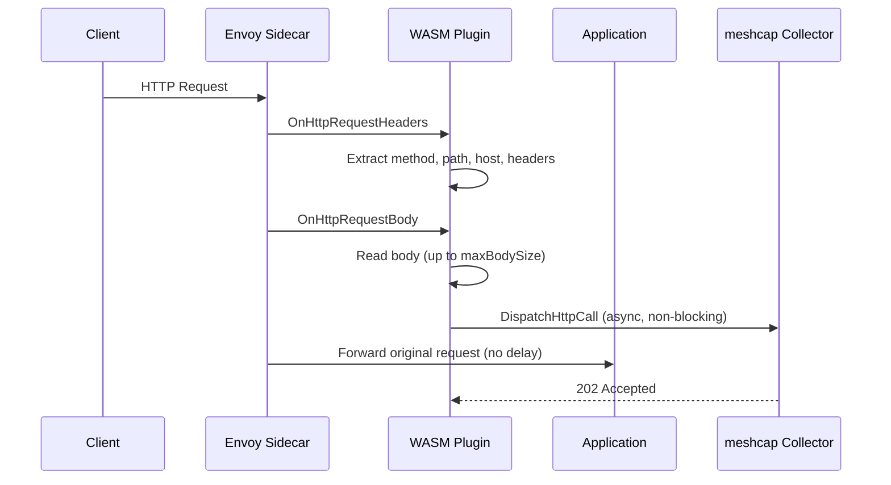

# WASM Plugin Guide

The meshcap WASM plugin is an HTTP filter that transparently captures request data from your service mesh and sends it to the meshcap collector. It is built on the [Proxy-Wasm](https://github.com/proxy-wasm/spec) specification, an open standard that defines a portable ABI between L4/L7 proxies and WebAssembly extensions.

## Proxy-Wasm Compatibility

Because meshcap implements the [Proxy-Wasm ABI](https://github.com/proxy-wasm/spec), the plugin works with any proxy or control plane that supports this specification. The Go SDK used is [`proxy-wasm-go-sdk`](https://github.com/proxy-wasm/proxy-wasm-go-sdk).

| Runtime | Support | How to deploy |
|---------|---------|---------------|
| **Istio** | via the [`WasmPlugin`](https://istio.io/latest/docs/reference/config/proxy_extensions/wasm-plugin/) CRD (`extensions.istio.io/v1alpha1`) | Istio configures Envoy sidecars to load the `.wasm` binary from an OCI registry. See [Deploying with Istio](#deploying-with-istio) below. |
| **Envoy** (standalone) | native, via `envoy.filters.http.wasm` | Configure the filter in `envoy.yaml` with a local file path or remote OCI fetch. |
| **Gloo Edge / Gloo Gateway** | via Envoy WASM filter | Same binary, configured through Gloo's upstream Envoy integration. |

Other proxies implementing the Proxy-Wasm spec (e.g. MOSN, OpenResty with `wasm-nginx-module`) can also load the plugin, although Istio is the primary tested deployment target.

## How It Works



Key properties:
- **Non-blocking** — Uses Envoy's `DispatchHttpCall` for async dispatch; the original request is not delayed
- **Configurable** — Collector address and max body size set via the `WasmPlugin` CRD
- **Metadata-aware** — Reads source pod name from Envoy node metadata

### Captured Fields

| Field | Source | Description |
|-------|--------|-------------|
| `request_id` | `x-request-id` header | Unique request identifier |
| `captured_at` | Plugin clock | RFC3339Nano timestamp |
| `timestamp_ns` | Plugin clock | Unix nanosecond timestamp |
| `req_method` | `:method` pseudo-header | HTTP method |
| `req_path` | `:path` pseudo-header | Request path |
| `req_host` | `:authority` pseudo-header | Target host |
| `req_http_version` | Hardcoded | `HTTP/1.1` |
| `req_headers` | All request headers | JSON-serialized map |
| `req_body` | Request body | Raw bytes (truncated to `maxBodySize`) |
| `req_body_size` | Computed | Actual body length captured |
| `client_ip` | `x-forwarded-for` header | Client IP address |
| `source_pod` | Envoy node metadata (`NAME`) | Source pod name |

## Using the Pre-built Plugin

Each [release](https://github.com/jycamier/meshcap/releases) publishes the WASM binary as an OCI artifact to GHCR:

```
ghcr.io/jycamier/meshcap/wasm-plugin:<version>
```

Istio can pull this artifact directly — no manual download is required. Simply reference the OCI URL in the `WasmPlugin` CRD (see below).

If you need the raw `.wasm` file (e.g. for local testing), you can pull it with [oras](https://oras.land/):

```bash
oras pull ghcr.io/jycamier/meshcap/wasm-plugin:0.1.0
tar xzf meshcap-wasm-plugin_0.1.0.tar.gz
```

You can inspect available tags with:

```bash
oras repo tags ghcr.io/jycamier/meshcap/wasm-plugin
```

## Building from Source

The WASM plugin is a separate Go module in `wasm/`:

```bash
make build-wasm
```

This compiles to `wasm/plugin.wasm` using `GOOS=wasip1 GOARCH=wasm`.

To push a custom build to your own registry:

```bash
cd wasm
tar czf plugin.wasm.tar.gz plugin.wasm
oras push ghcr.io/<your-org>/meshcap/wasm-plugin:dev \
  --config /dev/null:application/vnd.oci.image.config.v1+json \
  "plugin.wasm.tar.gz:application/vnd.oci.image.layer.v1.tar+gzip"
```

In CI, this is handled automatically by the release workflow.

## Deploying with Istio

Istio provides a first-class [`WasmPlugin`](https://istio.io/latest/docs/reference/config/proxy_extensions/wasm-plugin/) CRD that makes deployment straightforward: Istio handles pulling the binary from the OCI registry and injecting it into the Envoy sidecars.

### 1. Apply the WasmPlugin CRD

Create a `WasmPlugin` resource to tell Istio to inject the plugin into selected sidecars:

```yaml
apiVersion: extensions.istio.io/v1alpha1
kind: WasmPlugin
metadata:
  name: traffic-capture
  namespace: default
spec:
  selector:
    matchLabels:
      meshcap.io/enabled: "true"    # Only inject into pods with this label
  url: oci://ghcr.io/jycamier/meshcap/wasm-plugin:v0.1.0
  imagePullPolicy: IfNotPresent
  phase: AUTHN
  pluginConfig:
    collectorCluster: "outbound|8080||meshcap-meshcap.capture.svc.cluster.local"
    maxBodySize: 1048576
```

```bash
kubectl apply -f wasmplugin.yaml
```

### 2. Label Target Pods

Add the `meshcap.io/enabled: "true"` label to pods (or their namespace) that should have traffic captured:

```bash
# Label specific pods via deployment
kubectl patch deployment myapp -p '{"spec":{"template":{"metadata":{"labels":{"meshcap.io/enabled":"true"}}}}}'

# Or label the namespace to capture all traffic
kubectl label namespace default meshcap.io/enabled=true
```

After labeling, restart the pods so the sidecar picks up the WASM plugin:

```bash
kubectl rollout restart deployment myapp
```

## Plugin Configuration

The `pluginConfig` field in the `WasmPlugin` CRD accepts:

| Field | Default | Description |
|-------|---------|-------------|
| `collectorCluster` | `outbound\|8080\|\|collector.capture.svc.cluster.local` | Envoy cluster name for the collector service |
| `maxBodySize` | `1048576` (1 MB) | Maximum request body size to capture (bytes) |

### Finding the Collector Cluster Name

The `collectorCluster` must match an Envoy cluster name. To find it:

```bash
# Get the Envoy config dump from a sidecar
kubectl exec <pod> -c istio-proxy -- curl -s localhost:15000/clusters | grep meshcap
```

The format is typically: `outbound|<port>||<service>.<namespace>.svc.cluster.local`

## Troubleshooting

### Plugin Not Loading

Check Istio proxy logs for WASM-related errors:

```bash
kubectl logs <pod> -c istio-proxy | grep -i wasm
```

Common issues:
- **OCI pull failure** — Verify the `url` in the WasmPlugin CRD is accessible from the cluster
- **Selector mismatch** — Ensure the pod labels match the `selector.matchLabels`

### No Data Reaching the Collector

1. Verify the collector is running and reachable:
   ```bash
   kubectl get svc -n capture
   kubectl port-forward -n capture svc/meshcap-meshcap 8080:8080
   curl -X POST http://localhost:8080/ingest -d '{}' -H "Content-Type: application/json"
   ```

2. Check the `collectorCluster` value matches a valid Envoy cluster:
   ```bash
   kubectl exec <pod> -c istio-proxy -- curl -s localhost:15000/clusters | grep collector
   ```

3. Check for dispatch errors in the proxy logs:
   ```bash
   kubectl logs <pod> -c istio-proxy | grep "dispatch"
   ```

### High Latency Concerns

The WASM plugin uses `DispatchHttpCall` which is asynchronous — the original request is forwarded immediately without waiting for the collector response. If you observe latency, the cause is likely elsewhere (network, application). Verify by checking:

```bash
# Compare request timing with and without the plugin
kubectl logs <pod> -c istio-proxy | grep "response_duration"
```
